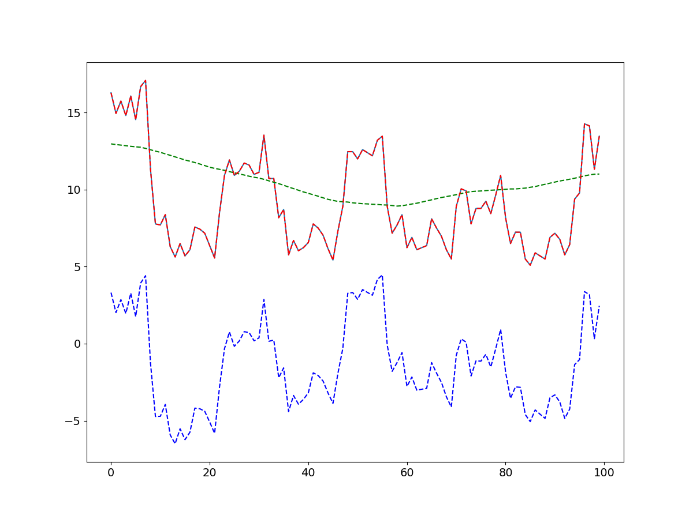
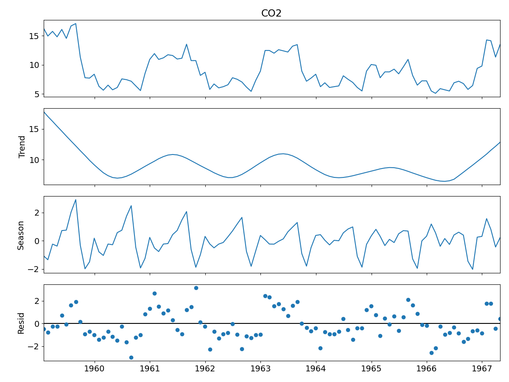

# Заметка 09-02-2024

## Задачи:
- Разобраться с декомпозицией (почему-то сумма тренда и остатков не равна исходному временному ряду);
- Использовать STL вместо MA;
- Если все в порядке и все работает, переходить к случайному блужданию.

## Работа:

### Декомпозиция временного ряда

Были проведены дополнительные тесты разложения временного ряда на тредновую и сезонную составляющие. В результате, была выявлена ошибка в наборе данных: в функцтию вывода графиков поступали данные со сдвигом из-за чего сумма трендовой и сезонной составляющей не совпадала с входным временным рядом.

#### Итог:
ИСПРАВЛЕНО

### Изучение работы STL и внедрение STL в модель

STL использует LOESS (локально оцененное сглаживание диаграммы рассеяния) для извлечения оценок сглаживания трех компонентов. Ключевыми входными данными в STL являются:

- season - Длина сезонного сглаживания. Должно быть нечетным.

- trend - Длина тренда сглаживается, обычно около 150% от season. Должно быть нечетным и больше, чем season.

- low_pass - Длина окна оценки нижних частот, обычно наименьшее нечетное число, превышающее периодичность данных.

Итог:
Получены следующие результаты для разложения временного ряда с помощью MA и STL:

MA decomposition: blue - trend, green - season, red - trend+season


STL decomposition

Так же выявлено следующее:
Для STL необходимо указывать период. Так же STL раскладывает временной ряд на 3 составляющее: трендовую, сезонную и остаточную составляющие.
### Случайное блуждание
Пример функции, которая возвращает временной ряд, сгенерированный с помощью случайного блуждания.
```python
def random_walk(
    df, start_value=0, threshold=0.5, 
    step_size=1, min_value=-np.inf, max_value=np.inf
):
    previous_value = start_value
    for index, row in df.iterrows():
        if previous_value < min_value:
            previous_value = min_value
        if previous_value > max_value:
            previous_value = max_value
        probability = random.random()
        if probability >= threshold:
            df.loc[index, 'value'] = previous_value + step_size
        else:
            df.loc[index, 'value'] = previous_value - step_size
        previous_value = df.loc[index, 'value']
    return df
```

### Вопросы к консультации:

1. Почему мы хотим рассматривать именно случайное блуждание, ведь оно всегода работает плохо? Правильно ли я понимаю, что случайное блуждание нужно не для того, что бы использовать в модели, а для генерации нестационарных временных рядов?

2. Стоит ли рассмотреть разложение временного ряда на сезонную и трендовую составляющие по схеме Multiplicative Decomposition и сравнить с Additive Decomposition?

3. 