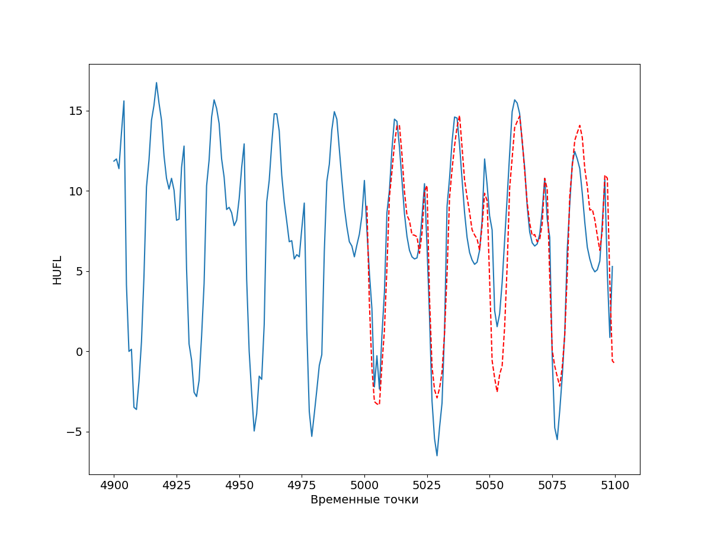

# Заметка 10-02-2024

## Задачи:
- Реализовать модель с декомпозицией на основе STL;
- Написать функцию генерации временного ряда с помощью случайного блуждания.

## Работа:

### Модель DLinearSTL
На основе модели DLinear была реализована модель DLienearSTL, где применяется разложение временного ряда на трендовую, сезонную и остаточную составляющие за счет STL декомпозции временного ряда.
```python
def decomposition(self, x):
        stl = STL(pd.Series(x.view(-1).tolist()), period=10)
        res = stl.fit()
        seasonal, trend, resid = torch.tensor(res.seasonal.tolist(), dtype=torch.float32).view(1, -1, 1),\
        torch.tensor(res.trend.tolist(), dtype=torch.float32).view(1, -1, 1),\
        torch.tensor(res.resid.tolist(), dtype=torch.float32).view(1, -1, 1)
        return seasonal, trend, resid
```
Результат предсказания модели, обученной на 100 эпохах:


MAE: 2.0371343302726745
MAPE: 0.40467809389649934
#### Итог:
ВЫПОЛНЕНО

### Случайное блуждание

Итог:
ПЕРЕНОСИТСЯ

### Вопросы к консультации:
