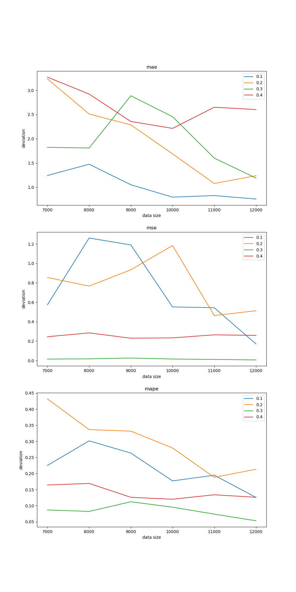
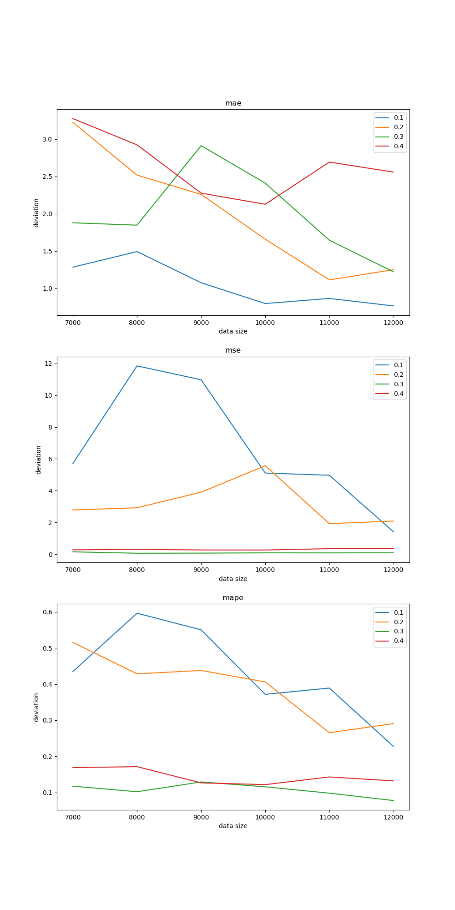
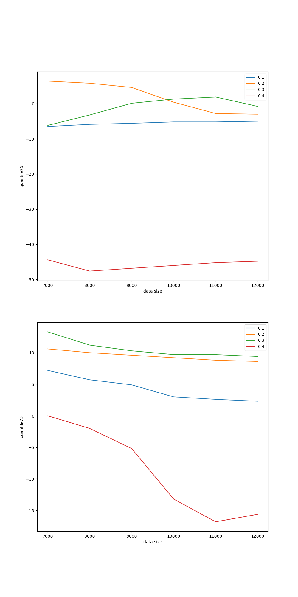

# Заметка 22-03-2024

## Разбор результатов

### Среднее отклонение по метрикам MAE, MAPE, MSE

### Также были посчитаны квантили для для всего датасета и для обучающих выборок также

## Выводы:

С увеличением обучающей выборки точность предсказания увеличивается. 

## Заметка

Квантиль от mape

Нормирование моделей min max (разница делить на ) + L1 регуляризации

Норммировать вектор из 100 значений. 

Вывести норму матрицы весов по типу графиков MAPE MAE MSE
