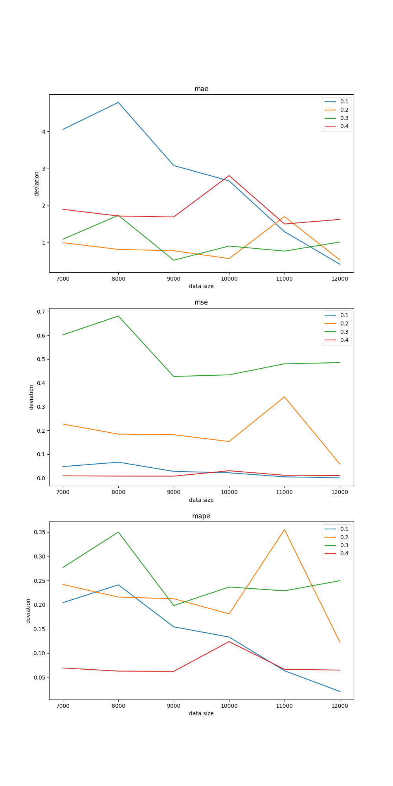
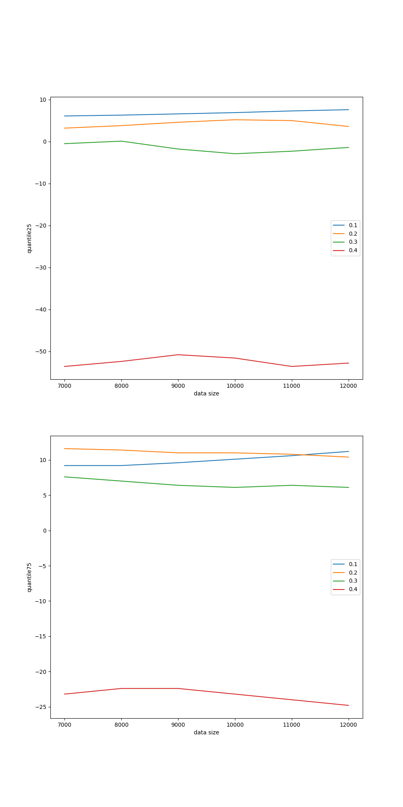

# Заметка 22-03-2024

## Разбор результатов

### Среднее отклонение по метрикам MAE, MAPE, MSE


.png)


### Также были посчитаны квантили для для всего датасета и для обучающих выборок также


```
Quantile 25 step=0.1 size=7000: 6.100000000000014
Quantile 75 step=0.1 size=7000: 9.200000000000005
Quantile 25 step=0.1 size=8000: 6.300000000000013
Quantile 75 step=0.1 size=8000: 9.200000000000005
Quantile 25 step=0.1 size=9000: 6.600000000000012
Quantile 75 step=0.1 size=9000: 9.6
Quantile 25 step=0.1 size=10000: 6.900000000000011
Quantile 75 step=0.1 size=10000: 10.1
Quantile 25 step=0.1 size=11000: 7.30000000000001
Quantile 75 step=0.1 size=11000: 10.599999999999998
Quantile 25 step=0.1 size=12000: 7.600000000000008
Quantile 75 step=0.1 size=12000: 11.199999999999996
Quantile 25 step=0.1: 8.500000000000005
Quantile 75 step=0.1: 18.50000000000001
Quantile 25 step=0.2 size=7000: 3.200000000000003
Quantile 75 step=0.2 size=7000: 11.599999999999994
Quantile 25 step=0.2 size=8000: 3.8000000000000034
Quantile 75 step=0.2 size=8000: 11.399999999999997
Quantile 25 step=0.2 size=9000: 4.600000000000004
Quantile 75 step=0.2 size=9000: 10.999999999999996
Quantile 25 step=0.2 size=10000: 5.200000000000005
Quantile 75 step=0.2 size=10000: 10.999999999999996
Quantile 25 step=0.2 size=11000: 5.000000000000004
Quantile 75 step=0.2 size=11000: 10.799999999999995
Quantile 25 step=0.2 size=12000: 3.600000000000003
Quantile 75 step=0.2 size=12000: 10.4
Quantile 25 step=0.2: -5.400000000000001
Quantile 75 step=0.2: 8.400000000000006
Quantile 25 step=0.3 size=7000: -0.5000000000000009
Quantile 75 step=0.3 size=7000: 7.599999999999996
Quantile 25 step=0.3 size=8000: 0.099999999999999
Quantile 75 step=0.3 size=8000: 6.9999999999999964
Quantile 25 step=0.3 size=9000: -1.775000000000001
Quantile 75 step=0.3 size=9000: 6.399999999999997
Quantile 25 step=0.3 size=10000: -2.9000000000000004
Quantile 75 step=0.3 size=10000: 6.099999999999997
Quantile 25 step=0.3 size=11000: -2.3000000000000007
Quantile 75 step=0.3 size=11000: 6.399999999999997
Quantile 25 step=0.3 size=12000: -1.400000000000001
Quantile 75 step=0.3 size=12000: 6.099999999999997
Quantile 25 step=0.3: -4.699999999999999
Quantile 75 step=0.3: 5.499999999999997
Quantile 25 step=0.4 size=7000: -53.59999999999989
Quantile 75 step=0.4 size=7000: -23.19999999999999
Quantile 25 step=0.4 size=8000: -52.39999999999989
Quantile 75 step=0.4 size=8000: -22.4
Quantile 25 step=0.4 size=9000: -50.7999999999999
Quantile 75 step=0.4 size=9000: -22.39999999999999
Quantile 25 step=0.4 size=10000: -51.599999999999895
Quantile 75 step=0.4 size=10000: -23.2
Quantile 25 step=0.4 size=11000: -53.59999999999989
Quantile 75 step=0.4 size=11000: -23.999999999999996
Quantile 25 step=0.4 size=12000: -52.79999999999989
Quantile 75 step=0.4 size=12000: -24.79999999999999
Quantile 25 step=0.4: -46.79999999999991
Quantile 75 step=0.4: -23.599999999999994
```


### Итоговые графики:




## Слудующие шаги

